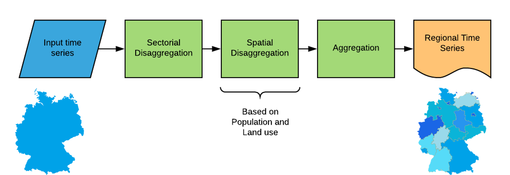
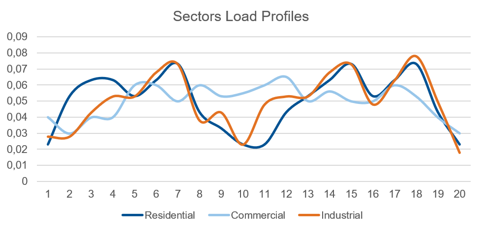
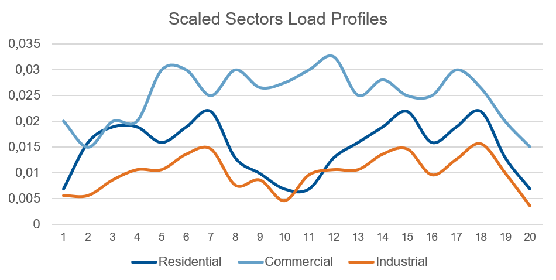
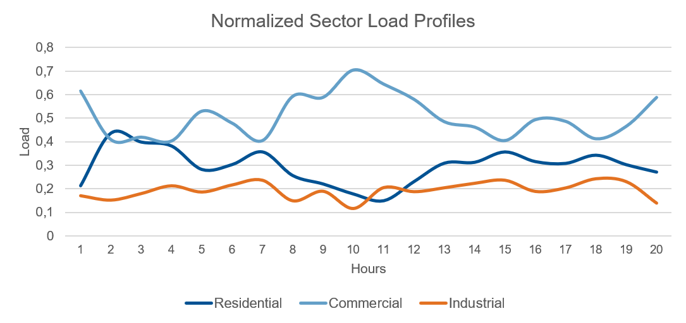
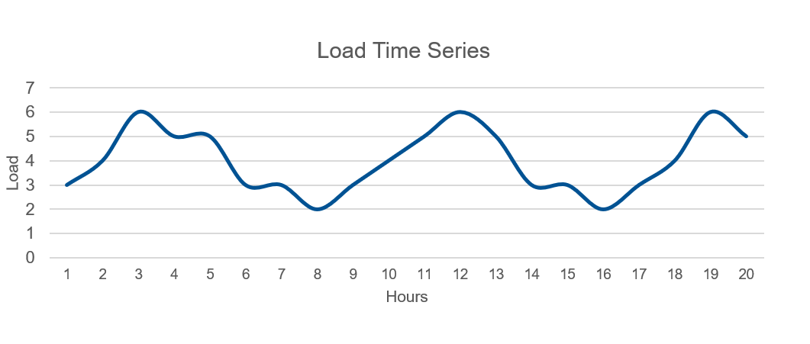
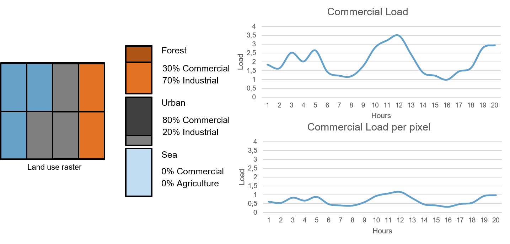
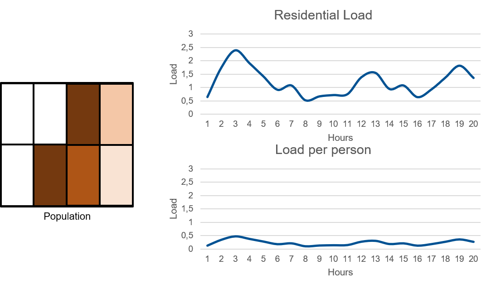

******
Theory
******
This chapters explains how the load time series are disaggregated spatially and according to sectors, then aggregated again
according to the desired model regions.

Purpose
-------

Load time series are widely available, but the published datasets are usually restricted to predefined spatial regions such as 
countries and their administrative subdivisions. The generate_load_timeseries() function takes the datasets which are available for these regions 
and disaggregate them according to a set of parameters, before aggregating them at a different spatial level. It is then possible to obtain time series for 
any region.

   
   Description of lib.generate_intermediate_files.generate_load_timeseries

Inputs
------

The main inputs of this script are:

* Load time series of the countries or regions to be disaggregated (hourly). 
* Shapefiles of the countries or regions to be disaggregated 
* Shapefiles of the regions of interest (subregions) 
* Assumptions (land use and sector correspondence) 
* Load profiles of the different sectors 
* Raster of the population and land use correspondent to the country or region 

Sectoral disaggregation
------------------------

The load is assumed to be perfectly divided into four distinct sectors (load sources):
 
* Commercial
* Industrial
* Residential
* Agricultural

   
   Sectoral load profiles

Sectoral load shares:

.. tabularcolumns:: |l|c|c|c|c|
	
+---------+----------+----------+-------------+-------------+
| Region  | Industry | Commerce | Residential | Agriculture |
+=========+==========+==========+=============+=============+
|    A    |   0.41%  |   0.28%  |     0.29%   |     0.02%   |
+---------+----------+----------+-------------+-------------+
|    B    |   0.31%  |   0.30%  |     0.38%   |     0.01%   |
+---------+----------+----------+-------------+-------------+
|    C    |   0.44%  |   0.30%  |     0.25%   |     0.01%   |
+---------+----------+----------+-------------+-------------+

An hourly load profile for each sector has been predefined for one week, the same load profile is assumed to repeat over the year. These load profiles are 
scaled and normalized based on sectoral load shares for each region(assumed to be constant throughout the spatial scope), by multiplying the load profiles by their 
corresponding share and normalizing their hourly sum to be equal to 1.

   
   Scaled sectoral load profiles
  

   
   Normalized sectoral load profiles
   
   
 
Once the load profiles are normalized, we can multiply them with the actual load time series to obtain the load timeseries for each sector. 

   
   Load time series
	
.. figure:: img/load_per_sector.png
   :width: 80%
   :align: center
   :alt: Load per Sector
   
   Sectoral load time series
   

Spatial disaggregation
----------------------

The next step is the spatial disaggregation, based on the land use and population concentration rasters. First, each land-use type is assigned a sectoral 
load percentage corresponding to the load components of the land use category. Then, the population concentration raster is used to calculate the population 
of each pixel.

   
   Example - Commerce sector spatial disaggregation

Counting the pixels, and land use occurrences inside of region for which the sectoral load timeseries has been calculated, the sectoral load 
for the Industry, commercial, and agricultural can be retrieved for each pixel of that region. Similarly, the residential load timeseries can 
be assigned to each pixel based on the population contained in the said pixel. The spatial disaggregation results in the assignment to every pixel inside a 
given region to be assigned a specific sectoral load timeseries.

	

   
   Example - Residential sector spatial disaggregation

Re-aggregation
--------------

The result of the sectoral and spatial disaggregation, performed in the first two sections can be used to retrieve the sectoral load timeseries and, 
therefore, the general load time series of any desired region by summing up the loads of every pixel contained within the region. If a subregion spans 
more than one region or country, it is divided into subregions restrained to each of those countries. 
